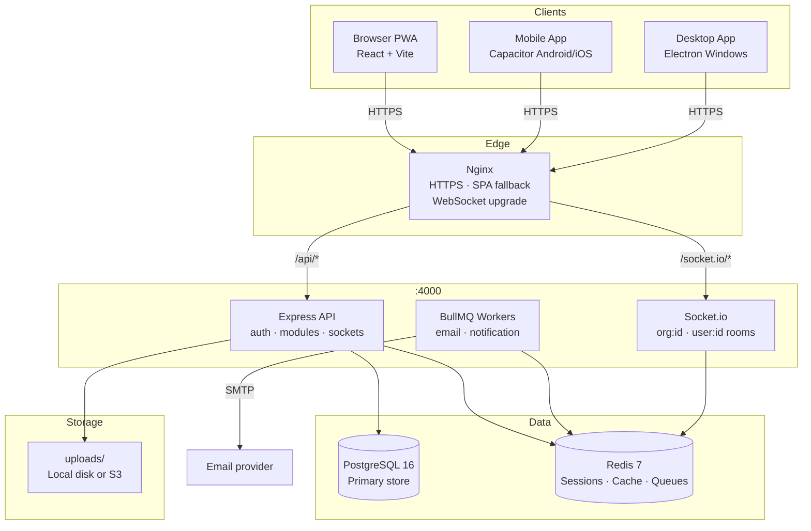
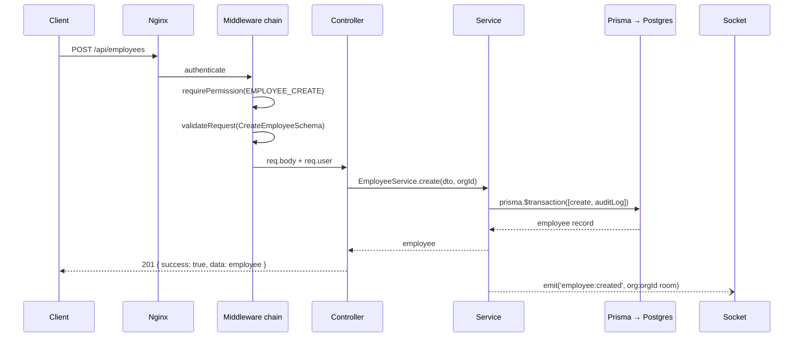
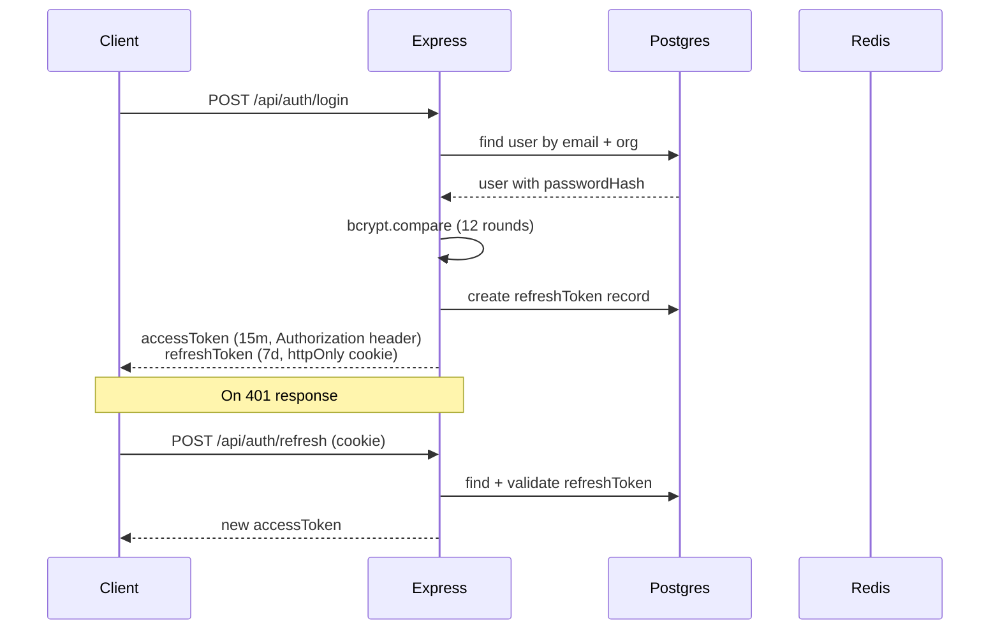
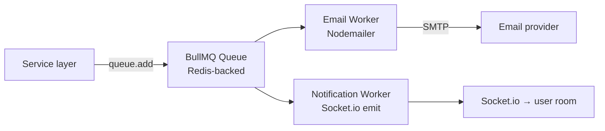

# System Architecture

## High-level overview



## Request lifecycle



## Authentication flow



## Multi-tenancy data isolation

Every request from an authenticated user carries `req.user.organizationId`.  
Every Prisma query on org-scoped data **must** include `{ organizationId: req.user.organizationId }`.  
This is enforced by `rule-security-rbac.md` and audited by `agent-api-security`.

```
User A (org: abc) → can only read/write rows where organizationId = "abc"
User B (org: xyz) → can only read/write rows where organizationId = "xyz"
Rows where organizationId is missing from the query = IDOR vulnerability
```

## Job queue architecture



Queues are defined in `backend/src/jobs/queues.ts`.  
Workers auto-start with the server in `backend/src/jobs/workers/`.
