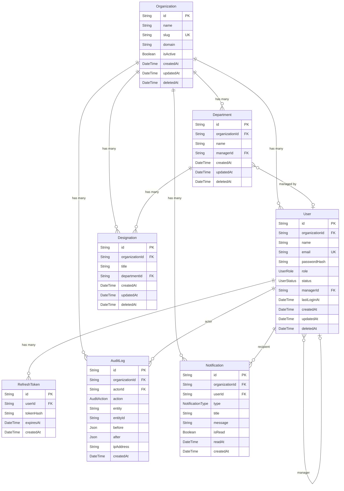

# Database — Entity Relationship Diagram

All models live in `prisma/schema.prisma`. Generated Prisma client is at `@prisma/client`.

## ERD



## Key constraints

| Rule | Enforcement |
|------|------------|
| Every org-scoped model has `organizationId` | `rule-database.md` |
| IDs are always UUID | `@default(uuid())` in schema |
| Soft delete only — no hard deletes | `deletedAt DateTime?` on every model |
| Sensitive fields end in `Encrypted` | `rule-database.md` naming convention |
| `@@index([organizationId])` on every org-scoped model | Required by `rule-database.md` |
| Enums defined in both `schema.prisma` AND `shared/src/enums.ts` | Must stay in sync |
| User foreign keys use `onDelete: Restrict` | Prevents accidental cascade deletes |

## Adding a new model (checklist)

```prisma
model MyModel {
  id             String    @id @default(uuid())
  organizationId String
  // ... your fields ...
  createdAt      DateTime  @default(now())
  updatedAt      DateTime  @updatedAt
  deletedAt      DateTime?

  organization   Organization @relation(fields: [organizationId], references: [id])

  @@index([organizationId])
  @@map("my_models")
}
```

Then run: `npm run db:migrate -- --name add-my-model && npm run db:generate`
